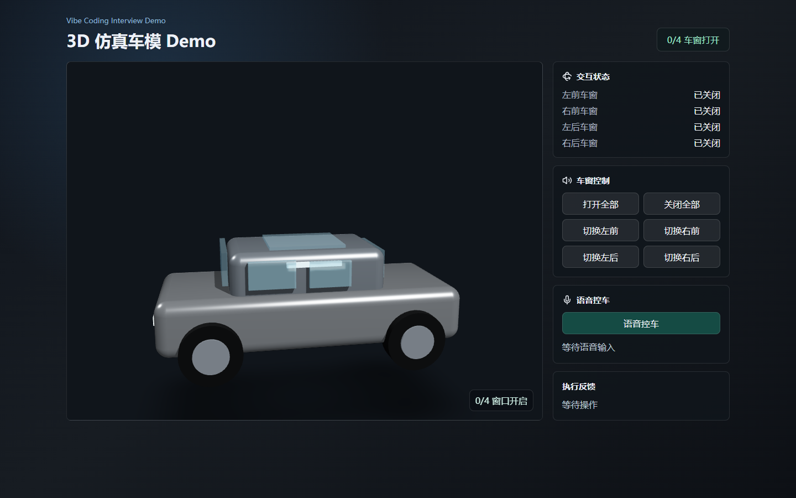
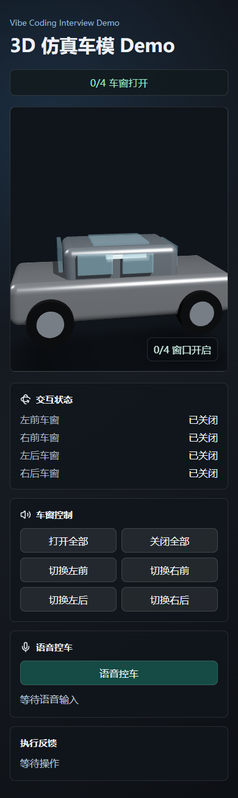

# 3D 仿真车模 Demo

一个面向 Vibe Coding 面试作业的网页端 3D 车控 Demo。

项目参考新能源汽车中控大屏的车模交互体验，实现了 3D 车模展示、拖动旋转、点击控车、语音控车和车辆状态反馈。项目重点不只是最终页面，也包括需求分析、系统架构设计和自动化验证等中间产物。

## 项目预览

### 桌面端



### 移动端



## 核心功能

- 3D 汽车模型展示
- 鼠标拖动旋转和缩放查看
- 点击车窗直接切换开关状态
- 分别控制左前、右前、左后、右后车窗
- 一键打开或关闭全部车窗
- 中文语音指令控制车窗
- 展示语音识别结果和控车执行反馈
- 车窗开关动画与状态同步
- 桌面端和移动端基础适配

## 支持的语音指令

示例：

```text
打开车窗
关闭车窗
打开全部车窗
关闭所有车窗
打开左前车窗
关闭右前车窗
打开左后车窗
关闭右后车窗
```

语音控制依赖浏览器提供的语音识别能力。建议使用 Chrome 或 Edge，并允许网页访问麦克风。若当前浏览器不支持语音识别，仍可通过车模点击和控制按钮完成演示。

## 技术栈

- React
- TypeScript
- Vite
- Three.js
- React Three Fiber
- Drei
- Web Speech API
- Playwright
- Lucide React

## 系统架构

项目采用纯前端单页应用架构，不依赖后端服务。

```text
用户输入
├─ 拖动旋转
├─ 点击车模
├─ 点击控制按钮
└─ 语音输入
        ↓
交互适配与指令解析
        ↓
统一车辆控制指令
        ↓
车辆状态 Store
        ↓
├─ 驱动 3D 车窗动画
├─ 更新控制面板状态
└─ 输出执行反馈
```

点击控车和语音控车不会直接修改 3D 模型，而是先转换成统一控制指令，再更新车辆状态，最后由状态同时驱动 3D 场景和页面 UI。

## 本地运行

### 1. 克隆项目

```bash
git clone https://github.com/Leisure-ll/vibe-car-demo.git
cd vibe-car-demo
```

### 2. 安装依赖

```bash
npm install
```

### 3. 启动开发环境

```bash
npm run dev
```

启动后访问：

```text
http://localhost:5173
```

## 构建生产版本

```bash
npm run build
```

构建产物会生成在 `dist` 目录。

本地预览生产版本：

```bash
npm run preview
```

## 自动化验证

项目包含基于 Playwright 的页面验证脚本，用于检查：

- 3D Canvas 是否成功渲染
- 桌面端页面是否可用
- 移动端页面是否可用
- “打开全部车窗”操作是否正确更新状态
- 自动生成验证截图

先启动项目：

```bash
npm run dev
```

再打开另一个终端运行：

```bash
npm run verify:render
```

默认截图输出目录：

```text
verification/
```

验证脚本默认使用 Windows 中 Chrome 的常见安装路径。需要自定义时，可设置：

```text
CHROME_PATH
DEMO_URL
```

## 项目结构

```text
vibe-car-demo/
├─ scripts/
│  └─ verify-render.mjs       # Playwright 自动化验证
├─ src/
│  ├─ components/
│  │  └─ VehicleScene.tsx     # 3D 场景和车辆模型
│  ├─ core/
│  │  ├─ browserVoiceControl.ts
│  │  ├─ commandParser.ts
│  │  ├─ contracts.ts
│  │  ├─ initialState.ts
│  │  └─ vehicleStore.ts
│  ├─ App.tsx                 # 页面与交互编排
│  ├─ main.tsx                # 应用入口
│  └─ styles.css              # 页面样式
├─ verification/              # 自动验证截图
├─ 3D仿真车模Demo需求文档.md
├─ 3D仿真车模Demo系统架构任务文档.md
├─ package.json
├─ tsconfig.json
└─ vite.config.ts
```

## 核心设计说明

### 统一状态源

四个车窗的开关状态集中保存在车辆状态 Store 中。车模点击、控制按钮和语音输入最终都通过同一套状态更新逻辑执行，避免 UI 状态与 3D 动画不一致。

### 输入与执行解耦

语音模块只负责将声音转换为文字，指令解析模块负责把文字转换为车辆控制指令，车辆状态模块负责真正执行控制。这样后续可以比较容易地增加车门、车灯、天窗和后备箱等能力。

### 可替换的 3D 展示层

当前 Demo 使用程序化方式搭建车身、车窗和车轮等部件。后续可以在保留控制逻辑的前提下，将展示层替换为更高精度的 GLB/glTF 车辆模型。

## Vibe Coding 中间产物

仓库保留了项目开发过程中产生的主要材料：

- 需求分析文档
- 系统架构任务文档
- 模块化源码
- 自动化验证脚本
- 桌面端和移动端验证截图

这些材料用于展示从需求理解、架构设计、功能实现到结果验证的完整开发过程。

## 当前范围

本项目是面试展示用 Demo，不是量产级车机系统。目前不包含：

- 真实车辆接口
- 用户账号和权限系统
- 后端服务
- 真实车控安全校验
- 工业级车辆物理仿真
- 全浏览器兼容保证

## 后续可扩展方向

- 替换为高精度 GLB/glTF 车模
- 增加车门、车灯、天窗和后备箱控制
- 增加文字指令输入
- 增加更多语音表达方式
- 增加摄像机预设视角
- 增加部署地址和在线演示
- 增加单元测试和持续集成

## 作者

GitHub：[@Leisure-ll](https://github.com/Leisure-ll)
